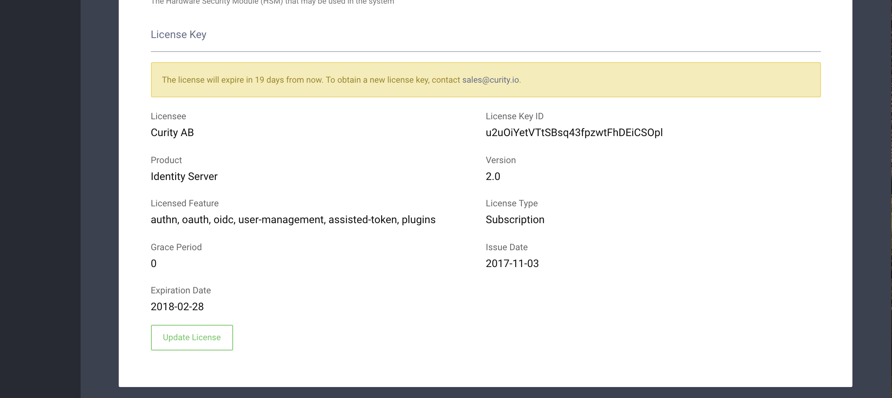
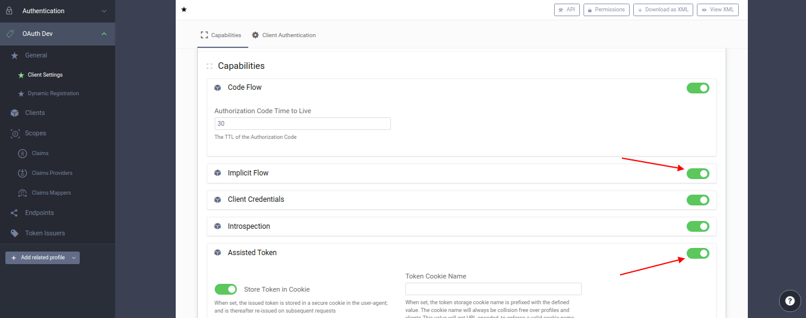
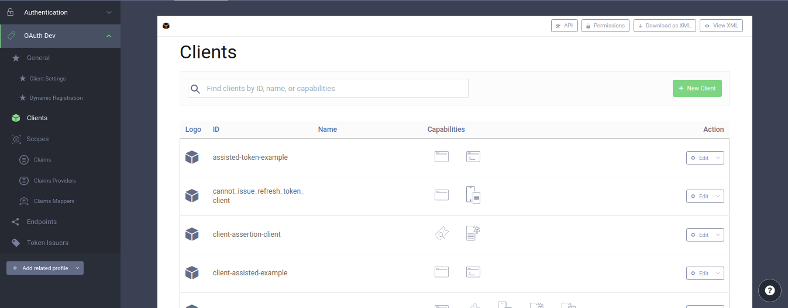
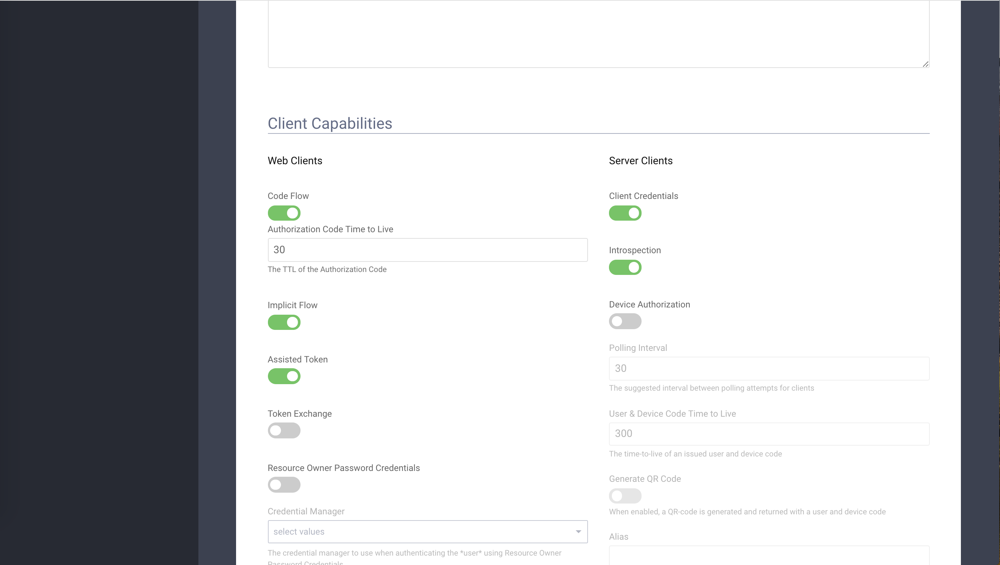
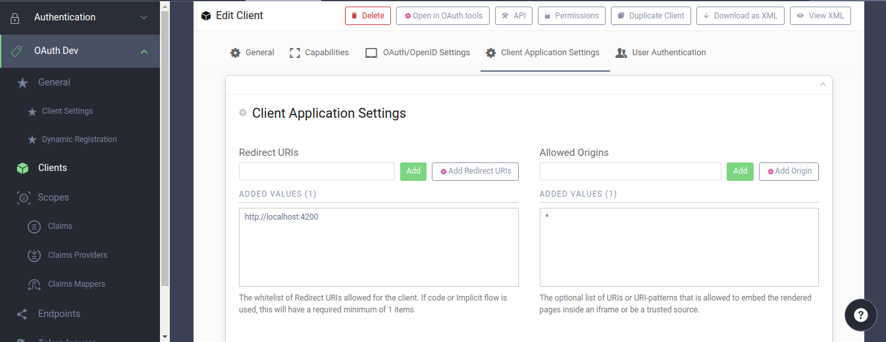

# React Assisted Token Example

Below you will find some information on how to perform common tasks.<br>

For the project to build, **these files must exist with exact filenames**:

* `public/index.html` is the page template;
* `src/index.js` is the JavaScript entry point.

You can delete or rename the other files.

You may create subdirectories inside `src`. For faster rebuilds, only files inside `src` are processed by Webpack.<br>
You need to **put any JS and CSS files inside `src`**, otherwise Webpack won’t see them.

Only files inside `public` can be used from `public/index.html`.<br>
Read instructions below for using assets from JavaScript and HTML.

You can, however, create more top-level directories.<br>
They will not be included in the production build so you can use them for things like documentation.

## Quick Start
In this example, an API call is made using an access token received from a Curity server after authentication using the "assisted token flow".
The client uses the React framework and shows how to use this development tool to perform the assisted token flow.
For that, it calls a RESTful API that is hosted in a separate node server. To start both, simply invoke the following command:

```nodemon
npm start
```

Then, navigate to http://localhost:3000 in a web browser.  

You can make changes to the React single-page application (SPA) to perform your own experimentation. 
If you do, the changes you make to the app's source files will automatically reload. 
If you change the API that the client invokes, you do not need to start the node API server. 
To do this, run `npm run run-app` instead of `npm start`.
If you want to start only the API, you can do so with the command `node server/server.js`.


## Build app for production

```nodemon
npm run build
```

Builds the app for production to the `build` folder.<br>
It correctly bundles React in production mode and optimizes the build for the best performance.

The build is minified and the filenames include the hashes.<br>
Your app is ready to be deployed!


## Curity Config
In order to run this example you need to make some configurations in Curity server.    
The easiest way is to [download and install the sample configuration](https://developer.curity.io/release/4.5.0/configuration-samples) from curity docs.   
This sample configuration has already configured one `Authentication Profile` and one `OAuth Profile`. The `OAuth Profile` also has an app configured (`client-assisted-example`).   
If you are not using the sample configuration, then you need to make sure that atleast these configuration requirements are met before you make the following changes.    


1. Login into the Admin UI and make sure that you have uploaded a valid license under `System -> General`.

   
   
2. Go to Token Service profile and make sure that at least `Implicit Flow` and `Assisted Token` are enabled on the `Client Settings` page of that profile.

   

3. Go to the `Clients` page of the profile and create a client called `client-assisted-example`.

   

4. This client (accessible from `Token Service -> Clients -> client-assisted-example -> Edit Client`) should have the `Implicit Flow` and `Assisted Token` capabilities selected under the `Capabilities` section.

   

5. Update the `Redirect URIs` and `Allowed Origins` settings for the `client-assisted-example` Client. The redirect URI should be `http://localhost:3000`. The allowed origin should be the same or, for testing purposes, you can also use `*`.

   
       
6. Commit the changes and you are all setup.


If you compare the final config with the sample config, then you will find the following salient differences.

```xml
<client-store>
    <config-backed>
        <client>
            <id>client-assisted-example</id>
            <redirect-uris>http://localhost:3000</redirect-uris>
            <allowed-origins>*</allowed-origins>
            <capabilities>
                <implicit/>
                <assisted-token/>
            </capabilities>
        </client>
        <!-- ... -->
    </config-backed>
</client-store>       
```

## Integrate with React App  
To integrate this example into any of React app, you need to copy `App Component` (`App.js`) and `constants.js` files into your project.


The last thing is to configure environment variables like `ISSUER`, `CLIENT_ID`, `API_URL`,`AUTH_SERVER_ORIGIN` and `OPENID_CONFIGURATION_URL` in `constants.js` file.
You can see the following example environment config:

```javascript
export const ISSUER = "https://localhost:8443/";
export const CLIENT_ID = "client-assisted-example";
export const API_URL = "http://127.0.0.1:8100";
export const AUTH_SERVER_ORIGIN = "http://127.0.0.1:8100";
export const OPENID_CONFIGURATION_URL = 'dev/oauth/anonymous/.well-known/openid-configuration';
```

## Supported Browsers

By default, the generated project uses the latest version of React.

You can refer [to the React documentation](https://reactjs.org/docs/react-dom.html#browser-support) for more information about supported browsers.

## More Information
For more information about Curity, its capabilities, and how to use it with React and other app development frameworks, visit [developer.curity.io](https://developer.curity.io/). For background information on using Curity for API access, consult the [API integration section of the Curity developer manual](https://support.curity.io/docs/4.5.0/developer-guide/api-integration/overview.html). For additional insights in how to use Curity with microservices and APIs from SPAs, read _[How to Control User Identity within Microservices](http://nordicapis.com/how-to-control-user-identity-within-microservices/)_ on the Nordic APIs blog. You may also be interested in validating tokens sent from the React front-end in a gateway like [Apigee](https://developer.curity.io/tutorials/apigee-integration) or [NGINX](https://github.com/curityio/nginx_phantom_token_module). 

## Licensing

This software is copyright (C) 2019 Curity AB. It is open source software that is licensed under the [Apache 2](LICENSE).
